# Python-Code-Summary
Portfolio for professional development, centered around my python projects 
 
<h4>
 Introduction
 <h4 />
 

  For the first two weeks of my live project with the Tech Academy I was working on the Python Project.  Our team was working on   developing a full scale MVC web application in Python using Django framework.  At the time I had joined the project much of the site had already been built so immediately it was a fantastic chance to jump in and start solving issues with existing code.  After a quick initial story to get to know the project I took on the task of building a calendar for the site.  With a lot of research and finding some helpful tutorials I was able to create my own functional calendar for the site with full CRUD capabilities.  During this project I learned a lot about time management and the workflow of and agile development cycle.  Our daily stand-ups were essential in helping me get real experience in working as part of a team on the same project.  With a lot of hard work, we were all able to deliver our pieces of the project on time, and through our team slack channel there was always a way to find help if you became stuck.  I am very proud of the work I did on this project and I learned a lot about how to deliver a product to customer specs.  Over the two week sprint I had a great opportunity to work as part of an awesome team of other junior developers and I am confident that I will use everything I learned in this sprint throughout the rest of my career.
 

  
 

  Below is a more in-depth description of the work I did on creating the calendar for the TravelScrape Project complete with images that show the code I wrote as well as the progression of the calendar portion of the project.
 

  
   
  <h5>
 The Calendar Story
 <h5 />
   
  

    Taking on the calendar story was a bit of a daunting task as a brand-new developer working on my first live project.  When I started there was not even a link in the drop down menu for the calendar so I knew everything I would be doing would be new for the site.
  

  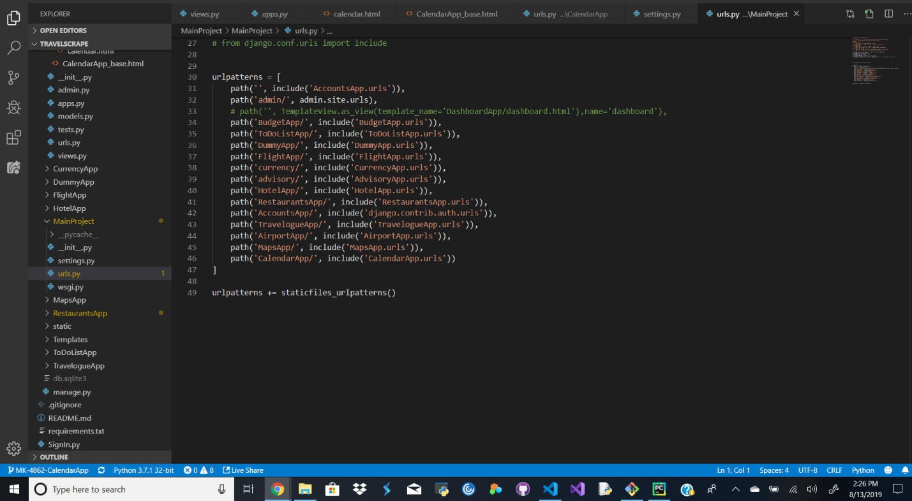
 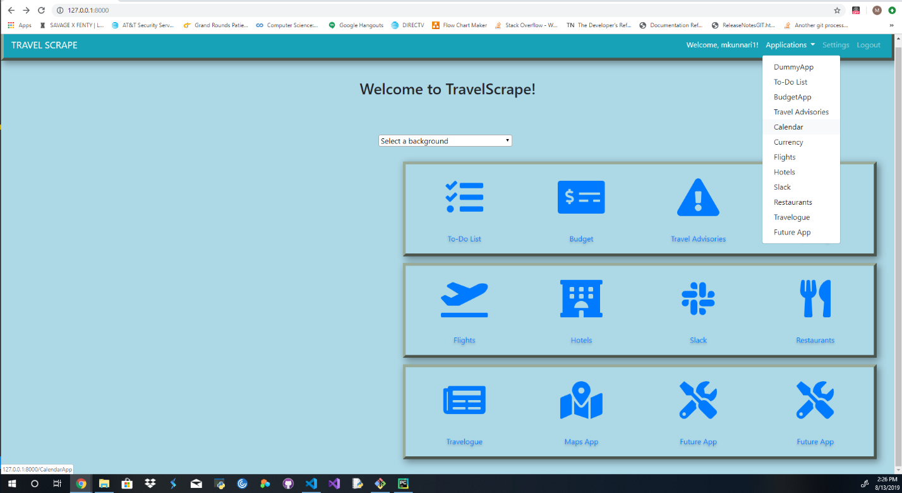
 After setting up a way to navigate to the calendar from the homepage I got to work on creating the calendar itself.
 
 The first thing I did was establish a calendar home page.
 
 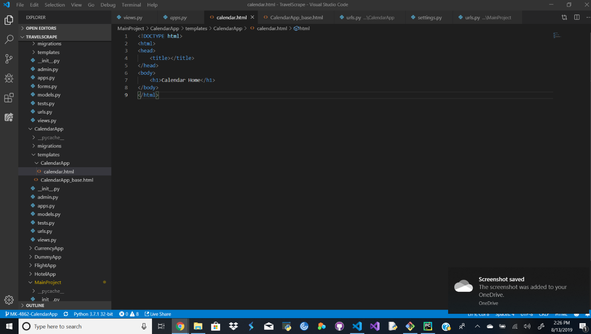
 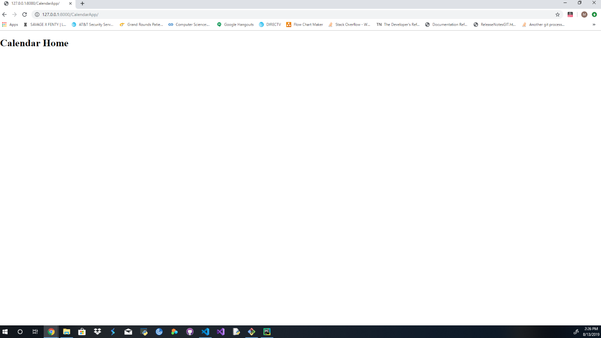
  
  From there I started working on building a calendar view that would instantiate with todays date and display in the proper calendar layout. I created a little bit of seed data to see how it would display initially so I knew where I was starting from.
  
 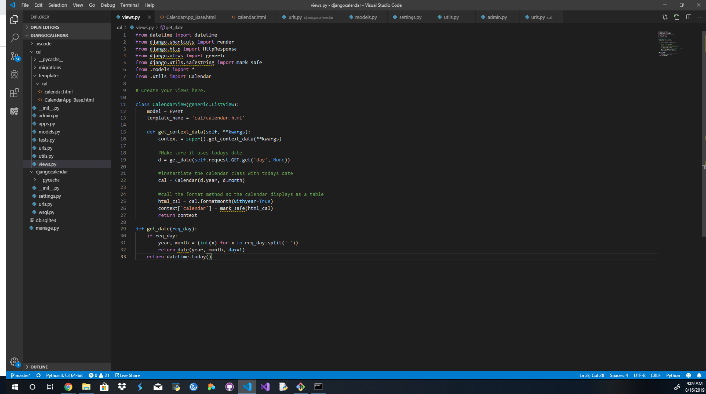
 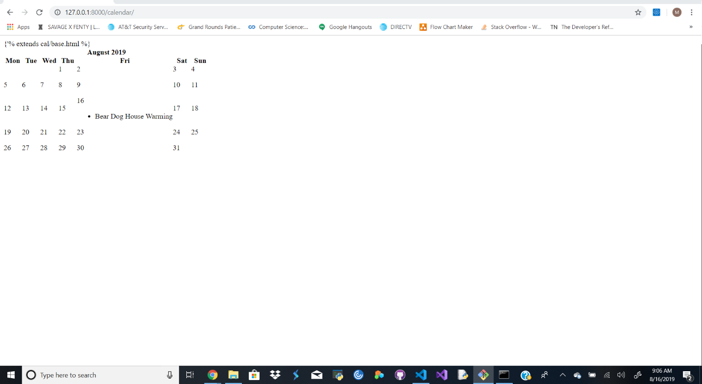
 
 At this point I had a calendar that would display an event, it wasn’t pretty but it was a step in the right direction.  From here I went on to start adding functionality and additional formatting so the calendar would look better but also have the capability to add events and be able to look at information about the created events.
 
 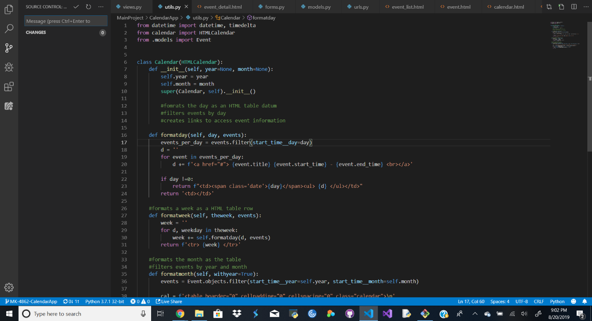
 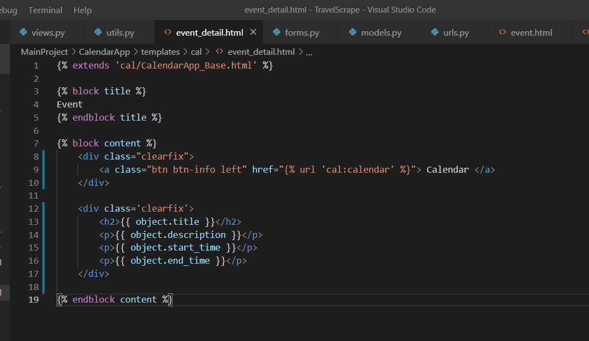
 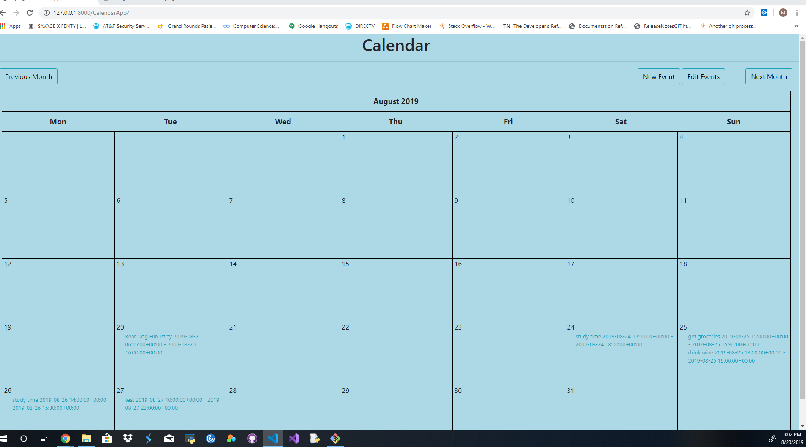
 
 Now with the calendar looking a little better and having buttons to be able to create new events and edit events I needed to be able to indicate to the user that the event had been saved to the calendar.  I also needed to finish adding CRUD functionality which meant being able to delete events.
 
 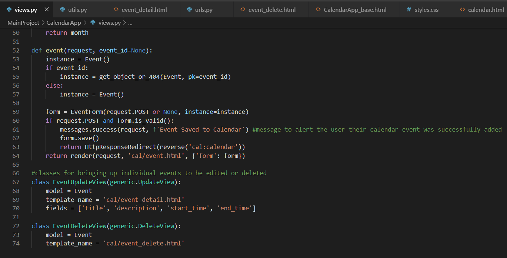
 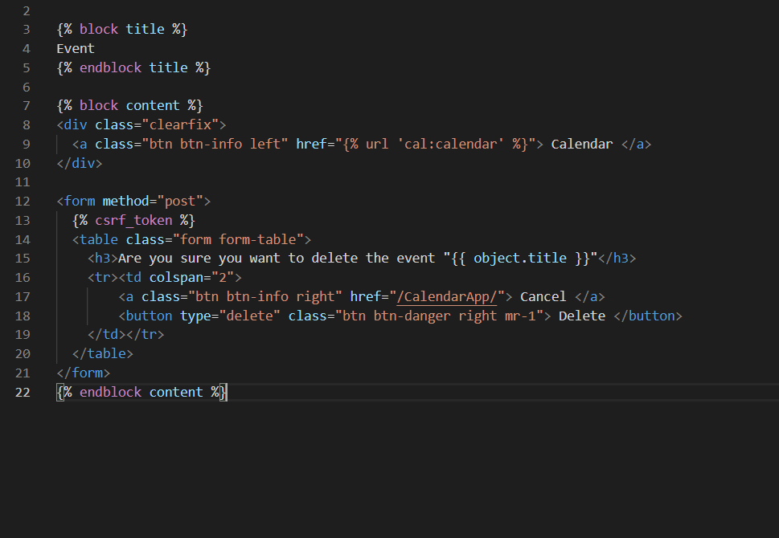
 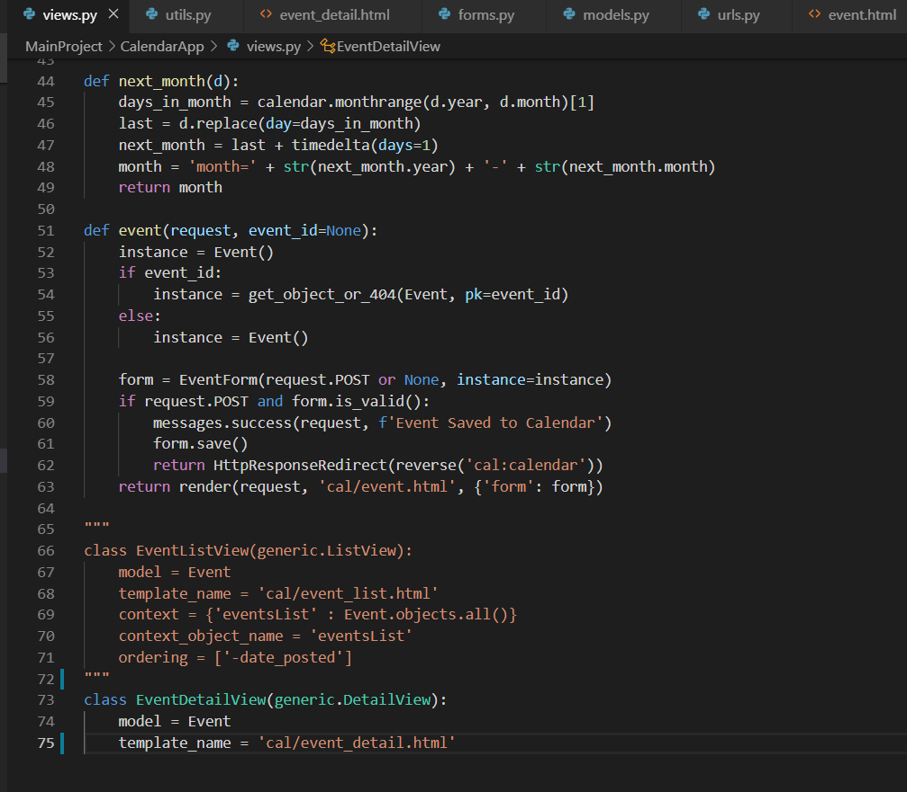
 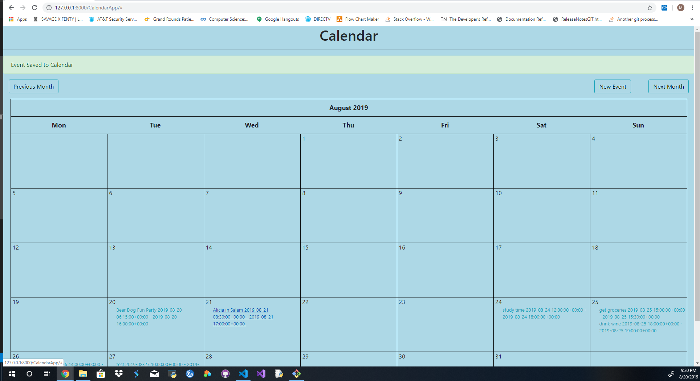
 
 After it was fully functional, I needed to make sure it would match the color palate we would be transitioning to soon and take care of more front-end work to really make it look clean.
 
 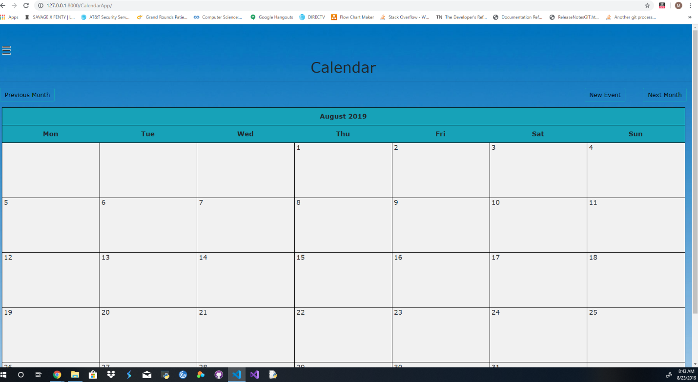
 
 The final product came out looking clean and had all the functionality that had been specified in the story, events could be created, read, updated and deleted.  

This story took up most of my time during the sprint due to its size and complexity, I feel very proud of what I made during this sprint and was happy that I was able to deliver a calendar that met expectations. 

Other skills learned: 

•	Working with a group of developers to communally solve issues. 
•	Improving project flow through regular communication. 
•	Knowing when to reach out for help. 
•	Learning how to integrate my code into a larger project. 

 
 
 
